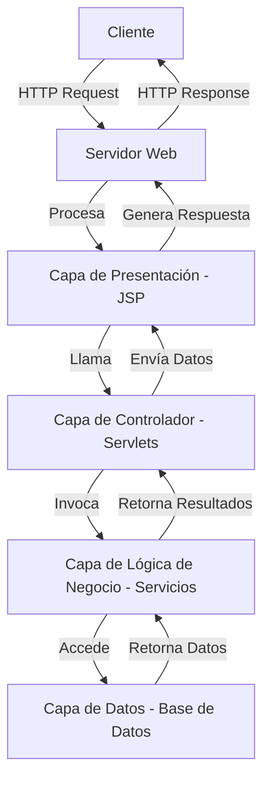

# Introducción a JSP y Servlets en Java

## 1. Arquitectura de una Aplicación JSP

Las aplicaciones JSP típicamente implementan una arquitectura de N-capas, distribuyendo las responsabilidades en diferentes niveles para optimizar la modularidad y facilitar el mantenimiento.



Para ver, editar o crear diagramas similares, puedes utilizar el editor en vivo de Mermaid: [https://mermaid.live](https://mermaid.live)

[El resto del contenido permanece sin cambios...]

## 2. Java Server Pages (JSP)

JSP es una tecnología que permite la creación de contenido web dinámico mediante la integración de HTML estático con código Java. Características principales:

- Compilación automática a Servlets por el contenedor web.
- Facilita la separación entre la lógica de presentación y la lógica de negocio.
- Utiliza etiquetas especiales para la inserción de código Java en páginas HTML.

Ejemplo básico de JSP:

```jsp
<%@ page language="java" contentType="text/html; charset=UTF-8" pageEncoding="UTF-8"%>
<!DOCTYPE html>
<html>
<head>
    <title>Mi primera página JSP</title>
</head>
<body>
    <h1>Bienvenido, <%= request.getParameter("nombre") %>!</h1>
    <p>Fecha y hora actual: <%= new java.util.Date() %></p>
</body>
</html>
```

## 3. Servlets

Los Servlets son componentes Java que extienden la funcionalidad de los servidores web para el manejo dinámico de solicitudes y respuestas HTTP.

Características clave:
- Heredan de la clase `HttpServlet`.
- Gestionan solicitudes HTTP específicas.
- Constituyen la base tecnológica de JSP.

Ejemplo de un Servlet básico:

```java
import java.io.*;
import javax.servlet.*;
import javax.servlet.http.*;

public class SaludoServlet extends HttpServlet {
    @Override
    protected void doGet(HttpServletRequest request, HttpServletResponse response) 
            throws ServletException, IOException {
        response.setContentType("text/html;charset=UTF-8");
        try (PrintWriter out = response.getWriter()) {
            out.println("<!DOCTYPE html>");
            out.println("<html><head>");
            out.println("<title>Saludo desde Servlet</title></head>");
            out.println("<body>");
            out.println("<h1>¡Hola desde SaludoServlet!</h1>");
            out.println("</body></html>");
        }
    }
}
```

## 4. Métodos HTTP en Servlets

Los Servlets principalmente utilizan los métodos HTTP GET y POST para procesar las solicitudes de los clientes.

| Método | Descripción | Uso común |
|--------|-------------|-----------|
| GET    | Solicita un recurso específico | Recuperación de datos, páginas web |
| POST   | Envía datos para ser procesados | Envío de formularios, carga de archivos |

Ejemplo de manejo de GET y POST en un Servlet:

```java
public class GestionUsuarioServlet extends HttpServlet {
    @Override
    protected void doGet(HttpServletRequest request, HttpServletResponse response)
            throws ServletException, IOException {
        // Lógica para recuperar y mostrar información de usuario
    }

    @Override
    protected void doPost(HttpServletRequest request, HttpServletResponse response)
            throws ServletException, IOException {
        // Lógica para procesar datos de formulario de usuario
    }
}
```

## Conceptos Fundamentales Adicionales

| Concepto | Descripción |
|----------|-------------|
| RequestDispatcher | Facilita la redirección de solicitudes a otros recursos dentro de la aplicación |
| Session | Mantiene el estado del usuario a lo largo de múltiples solicitudes HTTP |

## Conclusión

JSP y Servlets son tecnologías fundamentales en el desarrollo web con Java, ofreciendo una base sólida para la creación de aplicaciones web dinámicas y robustas. Mientras los Servlets se encargan de la lógica de negocio y el procesamiento de solicitudes, JSP se centra en la presentación, permitiendo una clara separación de responsabilidades.

Para profundizar en estos temas, se recomienda explorar:
- Ciclo de vida de Servlets y JSP
- Gestión avanzada de sesiones y cookies
- Integración con sistemas de bases de datos
- Frameworks modernos basados en Servlets, como Spring MVC

Esta introducción proporciona una base sólida para comenzar con el desarrollo web en Java utilizando JSP y Servlets. A medida que avances, descubrirás cómo estas tecnologías forman la columna vertebral de muchas aplicaciones web Java escalables y de alto rendimiento.