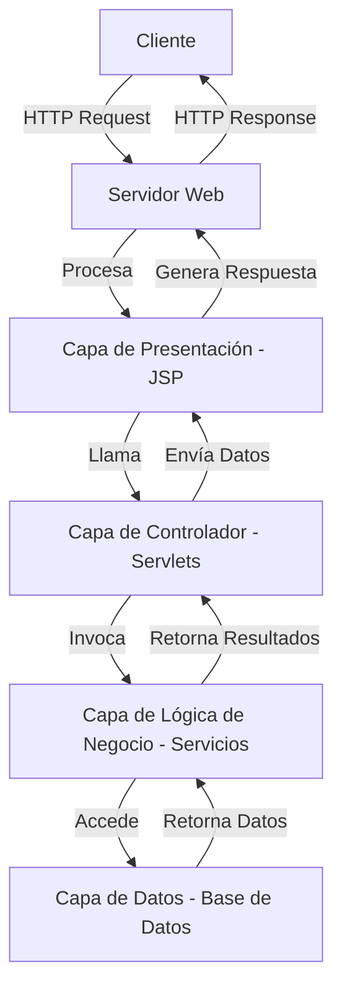

# Introducción a JSP y Servlets en Java

## 1. Arquitectura de una Aplicación JSP

Las aplicaciones JSP generalmente siguen una arquitectura de N-capas, lo que significa que las responsabilidades se distribuyen en diferentes capas para mejorar la modularidad y la mantenibilidad.

https://mermaid.live/edit#pako:eNpNkUtugzAQhq9ieR0uwKJSgKQPRRVKInURspjaU7AKNrVNpCrkSF3lCLlYB4cgZjWj-b95nrkwEnnMSwttxfZZoRnZ8pDWCrXHI4uip_5lv8_ZFn86dL5nyWGH9qSksewDP493IgnC3BqBDnqWHlJogUlkuUVHlUCo21WziL3t8hFJA7KpoSEgm4DUaG9NDUP9iA2tavRuZLLAvOqTEQStJmhzu5ZKBPcdSyOUGVlF7gNeBXgpBErs2XqCM_DGkT4Bh1M8MuvAbNEbq-Geob7zeo_cFl1XexqbBNl82pU-3f4mNp0v_4wabUDb4ba0UjI_53h31xrtaOIlX_AGbQNK0sfOg7LgvsIGCx6TK8F-F7zQF9JB583uVwsee9vhglvTlRWPv6B2FHWtBI-ZAnp7c5dc_gGHYKo_


## 2. Java Server Pages (JSP)

JSP es una tecnología que permite mezclar HTML estático con contenido dinámico generado por Java. Algunas características clave son:

- JSP se compila en Servlets por el contenedor web.
- Permite una separación más clara entre la lógica de presentación y la lógica de negocio.
- Utiliza etiquetas especiales para insertar código Java en páginas HTML.

Ejemplo básico de JSP:

```jsp
<%@ page language="java" contentType="text/html; charset=UTF-8" pageEncoding="UTF-8"%>
<!DOCTYPE html>
<html>
<head>
    <title>Mi primera página JSP</title>
</head>
<body>
    <h1>Hola, <%= request.getParameter("nombre") %>!</h1>
    <p>La fecha actual es: <%= new java.util.Date() %></p>
</body>
</html>
```

## 3. Servlets

Los Servlets son clases Java que extienden la funcionalidad de los servidores web para manejar solicitudes y respuestas HTTP dinámicamente.

Características principales:
- Extienden la clase `HttpServlet`.
- Manejan solicitudes HTTP específicas.
- Son la base de la tecnología JSP.

Ejemplo básico de Servlet:

```java
import java.io.*;
import javax.servlet.*;
import javax.servlet.http.*;

public class HolaMundoServlet extends HttpServlet {
    public void doGet(HttpServletRequest request, HttpServletResponse response) throws ServletException, IOException {

        response.setContentType("text/html");
        PrintWriter out = response.getWriter();
        out.println("<html><body>");
        out.println("<h1>Hola Mundo desde un Servlet!</h1>");
        out.println("</body></html>");
    }
}
```

## 4. Métodos HTTP en Servlets

Los Servlets principalmente utilizan los métodos HTTP GET y POST para procesar las solicitudes de los clientes.

| Método | Descripción | Uso típico |
|--------|-------------|------------|
| GET    | Solicita un recurso específico | Recuperar datos |
| POST   | Envía datos para ser procesados | Enviar formularios |

Ejemplo de manejo de GET y POST en un Servlet:

```java
public class MiServlet extends HttpServlet {
    public void doGet(HttpServletRequest request, HttpServletResponse response)
    throws ServletException, IOException {
        // Manejar solicitud GET
    }

    public void doPost(HttpServletRequest request, HttpServletResponse response)
    throws ServletException, IOException {
        // Manejar solicitud POST
    }
}
```

## Conceptos Adicionales

| Concepto | Descripción |
|----------|-------------|
| RequestDispatcher | Permite redirigir solicitudes a otros recursos |
| Session | Mantiene el estado del usuario entre múltiples solicitudes |


## Conclusión

JSP y Servlets son tecnologías fundamentales en el desarrollo web con Java. Mientras que los Servlets manejan la lógica de negocio y el procesamiento de solicitudes, JSP se centra en la presentación, permitiendo una clara separación de responsabilidades. Juntos, forman la base de muchas aplicaciones web Java robustas y escalables.

Para profundizar en estos temas, se recomienda explorar:
- Ciclo de vida de Servlets y JSP
- Manejo de sesiones y cookies
- Integración con bases de datos
- Frameworks basados en Servlets como Spring MVC
