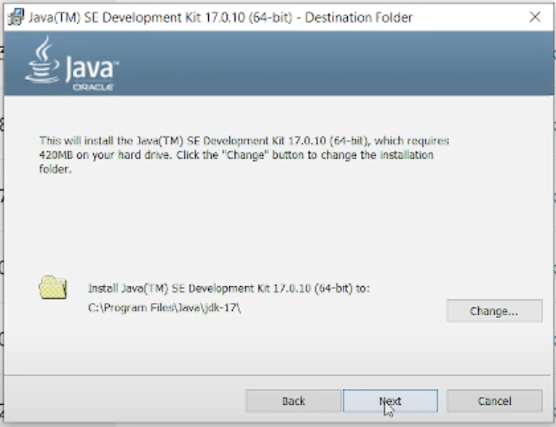
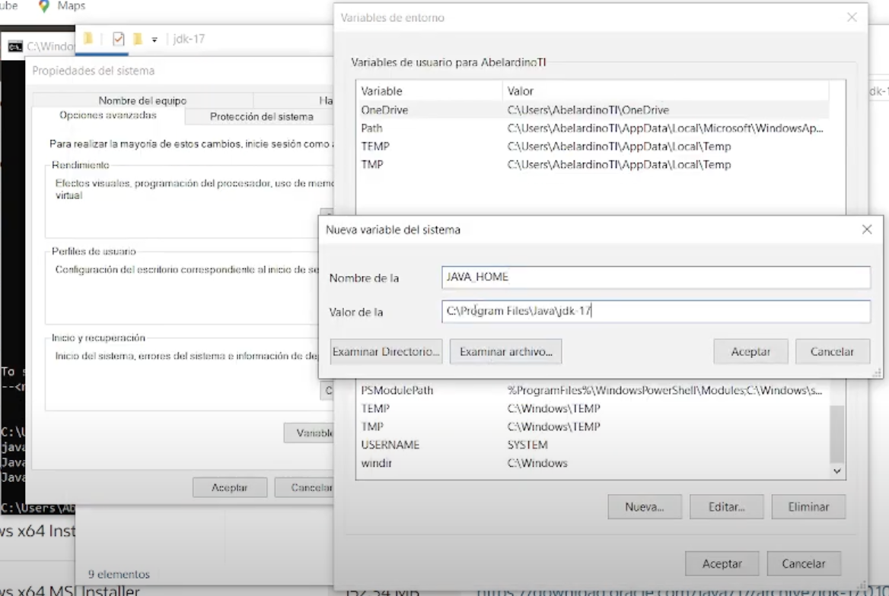

# Instalación del JDK (Java Development Kit)

El JDK es esencial para desarrollar aplicaciones Java, incluyendo JSP y Servlets. Sigue estos pasos para instalar el JDK en tu sistema:

## Paso 1: Descargar el JDK

## Paso 2: Instalar el JDK

## Paso 3: Configurar las variables de entorno

## Paso 4: Verificar la instalación

