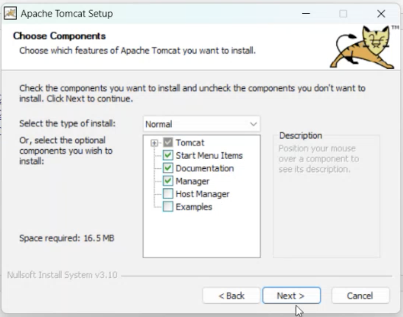

# Instalación de Apache Tomcat

Apache Tomcat es un contenedor de servlets open-source que implementa varias especificaciones de Java EE, incluyendo Java Servlet y JavaServer Pages (JSP). Esta guía te ayudará a instalar Tomcat en tu sistema.

## Paso 1: Descargar Apache Tomcat

1. Visita la página oficial de Apache Tomcat: [https://tomcat.apache.org/](https://tomcat.apache.org/)
2. En la sección de descargas, elige la versión de Tomcat que deseas instalar (recomendamos la última versión estable).

## Paso 2: Ejecutar el instalador

